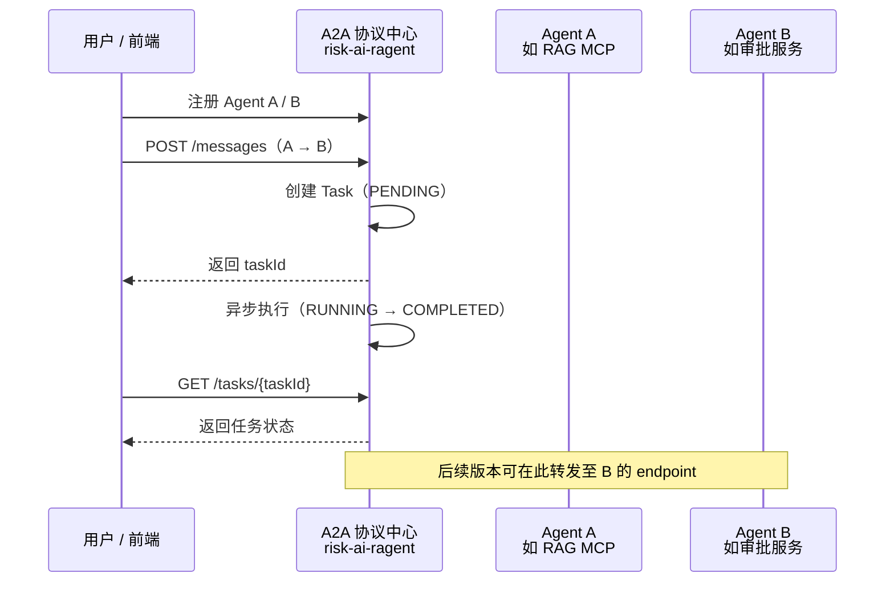

# A2A 协议指南（Agent-to-Agent）

本项目内置 **A2A（Agent-to-Agent）协议中心**，用于注册、发现和管理多个智能体（Agent），并在 Agent 之间发起消息投递与任务状态追踪。当前版本为 **草稿（draft）** 阶段，侧重协议建模、注册表与任务生命周期管理，消息投递为异步模拟执行，便于后续对接真实 Agent 服务。

---

## 1. 协议定位

| 维度 | 说明 |
|------|------|
| **目标** | 统一描述 Agent 元数据、能力清单、Endpoint、消息结构与任务状态 |
| **典型场景** | 风控 RAG Agent 与外部审批 Agent、报表 Agent、规则引擎 Agent 协同 |
| **与 MCP 关系** | MCP 负责**工具调用**（单 Agent 对外暴露能力）；A2A 负责**多 Agent 协作**（Agent 之间发现、路由、任务追踪） |



---

## 2. 前端入口

| 角色 | 路径 | 页面 |
|------|------|------|
| 普通用户 | `/user/a2a-protocol` | A2A 协议中心：概览、注册 Agent、发消息、查任务 |
| 管理员 | `/admin/a2a-management` | A2A 管理：Agent / 任务分页、编辑、删除、连通性检测 |

> 所有 `/api/user/a2a/**` 接口需登录，请求头携带 `Authorization: Bearer <token>`。

---

## 3. 数据模型

### 3.1 Agent（`a2a_agent`）

| 字段 | 类型 | 说明 |
|------|------|------|
| `agent_id` | VARCHAR(64) | 唯一标识，注册时自动生成 |
| `name` | VARCHAR(100) | Agent 名称 |
| `description` | VARCHAR(500) | 描述 |
| `capabilities` | TEXT | 能力列表，逗号分隔存储（如 `检索,问答,审批`） |
| `endpoint` | VARCHAR(255) | 服务地址，用于连通性检测 |
| `status` | VARCHAR(32) | 状态，默认 `ACTIVE` |

### 3.2 Task（`a2a_task`）

| 字段 | 类型 | 说明 |
|------|------|------|
| `task_id` | VARCHAR(64) | 任务唯一 ID |
| `from_agent_id` | VARCHAR(64) | 发送方 Agent |
| `to_agent_id` | VARCHAR(64) | 接收方 Agent |
| `message` | TEXT | 消息内容 |
| `status` | VARCHAR(32) | 任务状态 |
| `detail_message` | VARCHAR(512) | 状态详情 |

### 3.3 任务状态流转

```
PENDING → RUNNING → COMPLETED
   ↓         ↓
CANCELLED  CANCELLED
```

| 状态 | 含义 |
|------|------|
| `PENDING` | 已受理，等待执行 |
| `RUNNING` | 执行中 |
| `COMPLETED` | 已完成 |
| `CANCELLED` | 已取消（`PENDING` / `RUNNING` 可取消，`COMPLETED` 不可取消） |

当前实现中，任务在后台线程约 **2.4 秒**内模拟完成（1.2s → RUNNING，再 1.2s → COMPLETED）。

---

## 4. API 一览

基础路径：`http://localhost:8080/api/user/a2a`

统一响应格式：

```json
{
  "code": 200,
  "message": "success",
  "data": { }
}
```

### 4.1 协议概览

| 方法 | 路径 | 说明 |
|------|------|------|
| GET | `/api/user/a2a` | 协议简介、原则、接入建议、已注册 Agent 数量 |

**响应示例：**

```json
{
  "code": 200,
  "data": {
    "name": "A2A Protocol",
    "title": "A2A 协议中心",
    "description": "用于统一展示 Agent-to-Agent 协议概念...",
    "principles": ["Agent 能力描述与发现", "任务路由与协商", "消息格式统一", "异步回调与状态追踪"],
    "suggestions": ["先定义 Agent 元数据与能力清单。", "再约定请求、响应与错误结构。", "最后补充鉴权、审计和限流。"],
    "status": "draft",
    "registeredAgents": 2
  }
}
```

### 4.2 Agent 管理

| 方法 | 路径 | 说明 |
|------|------|------|
| GET | `/agents` | 列出全部 Agent（最多 1000 条） |
| GET | `/agents/page` | 分页查询，支持 `keyword` |
| POST | `/agents` | 注册 Agent |
| PUT | `/agents/{agentId}` | 更新 Agent |
| DELETE | `/agents/{agentId}` | 删除 Agent |
| GET | `/agents/{agentId}/connectivity` | 连通性检测（GET endpoint，Accept: text/event-stream） |

**注册 Agent 请求体：**

```json
{
  "name": "风控 RAG Agent",
  "description": "提供知识库检索与问答能力",
  "capabilities": ["检索", "问答", "统计"],
  "endpoint": "http://localhost:8080/sse"
}
```

**注册成功响应：**

```json
{
  "code": 200,
  "data": {
    "agentId": "a1b2c3d4e5f6...",
    "name": "风控 RAG Agent",
    "description": "提供知识库检索与问答能力",
    "capabilities": ["检索", "问答", "统计"],
    "endpoint": "http://localhost:8080/sse",
    "status": "ACTIVE",
    "registeredAt": "2026-07-12T20:00:00"
  }
}
```

**更新 Agent 请求体（额外需要 `status`）：**

```json
{
  "name": "风控 RAG Agent",
  "description": "更新后的描述",
  "capabilities": ["检索", "问答"],
  "endpoint": "http://localhost:8080/sse",
  "status": "ACTIVE"
}
```

**分页参数：**

| 参数 | 默认 | 说明 |
|------|------|------|
| `pageNum` | 1 | 页码 |
| `pageSize` | 10 | 每页条数 |
| `keyword` | — | 按名称或描述模糊搜索 |

### 4.3 消息与任务

| 方法 | 路径 | 说明 |
|------|------|------|
| POST | `/messages` | 发送 Agent 间消息，创建任务 |
| GET | `/tasks` | 分页查询任务 |
| GET | `/tasks/{taskId}` | 查询单个任务状态 |
| DELETE | `/tasks/{taskId}` | 取消任务 |

**发送消息请求体：**

```json
{
  "fromAgentId": "agentIdOfSender",
  "toAgentId": "agentIdOfReceiver",
  "message": "请根据以下工单内容给出风控建议：..."
}
```

**发送成功响应：**

```json
{
  "code": 200,
  "data": {
    "taskId": "f7e8d9c0...",
    "fromAgentId": "agentIdOfSender",
    "toAgentId": "agentIdOfReceiver",
    "message": "请根据以下工单内容给出风控建议：...",
    "status": "PENDING"
  }
}
```

**任务状态查询响应：**

```json
{
  "code": 200,
  "data": {
    "taskId": "f7e8d9c0...",
    "status": "COMPLETED",
    "message": "message delivered from 风控 RAG Agent to 审批 Agent",
    "updatedAt": "2026-07-12T20:00:05"
  }
}
```

**任务分页参数：**

| 参数 | 说明 |
|------|------|
| `pageNum` / `pageSize` | 分页 |
| `keyword` | 按 taskId 或 message 搜索 |
| `status` | 按状态过滤：`PENDING` / `RUNNING` / `COMPLETED` / `CANCELLED` |

---

## 5. curl 示例

先登录获取 Token：

```bash
curl -s -X POST http://localhost:8080/api/auth/login \
  -H "Content-Type: application/json" \
  -d '{"username":"user","password":"user123"}'
```

将返回的 `token` 代入下方 `$TOKEN`。

### 注册两个 Agent

```bash
# Agent A：本项目的 MCP / RAG 服务
curl -s -X POST http://localhost:8080/api/user/a2a/agents \
  -H "Authorization: Bearer $TOKEN" \
  -H "Content-Type: application/json" \
  -d '{
    "name": "风控 RAG Agent",
    "description": "MCP + RAG 问答",
    "capabilities": ["检索", "问答"],
    "endpoint": "http://localhost:8080/sse"
  }'

# Agent B：示意外部服务
curl -s -X POST http://localhost:8080/api/user/a2a/agents \
  -H "Authorization: Bearer $TOKEN" \
  -H "Content-Type: application/json" \
  -d '{
    "name": "审批 Agent",
    "description": "工单审批",
    "capabilities": ["审批", "通知"],
    "endpoint": "http://localhost:8081/health"
  }'
```

### 发送消息并轮询状态

```bash
# 发送（替换 fromAgentId / toAgentId 为实际值）
curl -s -X POST http://localhost:8080/api/user/a2a/messages \
  -H "Authorization: Bearer $TOKEN" \
  -H "Content-Type: application/json" \
  -d '{
    "fromAgentId": "<fromAgentId>",
    "toAgentId": "<toAgentId>",
    "message": "请审批该笔交易的风控结论"
  }'

# 查询状态（替换 taskId）
curl -s http://localhost:8080/api/user/a2a/tasks/<taskId> \
  -H "Authorization: Bearer $TOKEN"
```

### 连通性检测

```bash
curl -s http://localhost:8080/api/user/a2a/agents/<agentId>/connectivity \
  -H "Authorization: Bearer $TOKEN"
```

---

## 6. 代码结构

| 模块 | 路径 |
|------|------|
| Controller | `controller/api/user/UserA2AController.java` |
| Service | `service/A2AProtocolService.java` |
| Entity | `entity/A2aAgent.java`、`entity/A2aTask.java` |
| Mapper | `mapper/A2aAgentMapper.java`、`mapper/A2aTaskMapper.java` |
| DTO | `dto/A2A*.java` |
| 建表脚本 | `resources/schema.sql`（`a2a_agent`、`a2a_task`） |

前端：

| 模块 | 路径 |
|------|------|
| 用户端 | `risk-ai-web/src/views/user/A2AProtocol.vue` |
| 管理端 | `risk-ai-web/src/views/admin/A2AManagement.vue` |

---

## 7. 接入建议

1. **先注册 Agent**：为每个参与协作的服务填写 `name`、`capabilities`、`endpoint`。
2. **约定消息格式**：当前 `message` 为纯文本；生产环境建议约定 JSON Schema（如 `{ "type": "...", "payload": {} }`）。
3. **Endpoint 规范**：连通性检测对 endpoint 发起 **GET**，并带 `Accept: text/event-stream`。若 Agent 为 MCP SSE 服务，可填 `http://localhost:8080/sse`。
4. **轮询或推送**：前端可在发送消息后轮询 `GET /tasks/{taskId}`；后续可扩展 WebSocket / SSE 推送。
5. **鉴权扩展**：当前 A2A API 与普通用户 API 共用 Token 鉴权；跨 Agent 调用建议在 endpoint 侧增加 API Key 或 mTLS。

---

## 8. 与 MCP 的配合示例

典型组合：**MCP 暴露单 Agent 能力，A2A 编排多 Agent 协作**。

```
用户提问
  → A2A 任务：RAG Agent 检索问答
  → A2A 任务：审批 Agent 复核结论
  → 聚合结果返回用户
```

- MCP 接入详见 [MCP接入指南.md](MCP接入指南.md)
- 可将本项目的 MCP SSE 地址（`http://localhost:8080/sse`）注册为 A2A Agent 的 `endpoint`

---

## 9. 当前限制与后续规划

| 项目 | 现状 | 后续 |
|------|------|------|
| 消息投递 | 内存线程模拟，不真正调用 toAgent 的 endpoint | 转发 HTTP / gRPC / MCP 至目标 Agent |
| 协议状态 | `draft` | 稳定版后改为 `enabled` |
| 鉴权 | 仅平台登录 Token | Agent 级 API Key、调用审计 |
| 回调 | 无 | 任务完成后 Webhook 通知 |
| 管理员 API | 管理端复用 `/api/user/a2a/**` | 可拆分为 `/api/admin/a2a/**` |

---

## 10. 常见问题

**Q：注册 Agent 时 endpoint 填什么？**  
A：填该 Agent 可被探测的 HTTP 地址。对本项目 RAG/MCP 服务，推荐 `http://localhost:8080/sse`。

**Q：发送消息后为什么很快变成 COMPLETED？**  
A：当前为演示版异步模拟；`detail_message` 会显示 `message delivered from X to Y`，并未真正访问目标 endpoint。

**Q：连通性检测失败怎么办？**  
A：确认 endpoint 可访问、服务已启动；检测超时为连接 3s、读取 5s。404/405 等会反映在返回的 HTTP 状态码说明中。

**Q：A2A 和 MCP 应该选哪个？**  
A：对外给 Cursor/Claude 调工具用 **MCP**；在系统内注册多个 Agent、追踪协作任务用 **A2A**。两者可叠加使用。

---

## 相关文档

- [MCP接入指南.md](MCP接入指南.md) — MCP 工具与 Cursor 配置
- [RAG架构说明.md](RAG架构说明.md) — RAG 整体架构
- [快速理解代码.md](快速理解代码.md) — 代码导航
